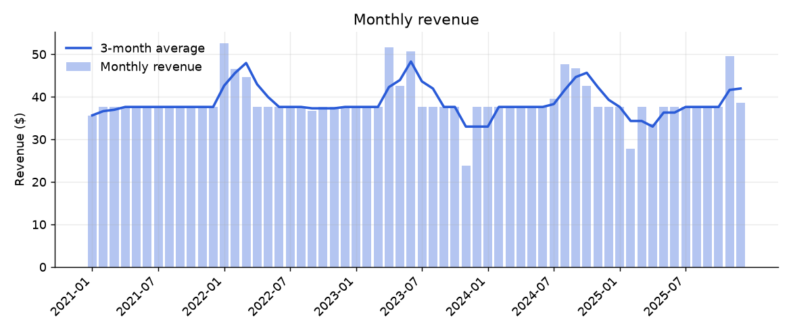

# SQL Sales Analysis

[](https://github.com/jayraj0975/sql-sales-analysis/actions/workflows/ci.yml)

Ten SQL queries that answer business questions about a digital music store: revenue trends, customer
concentration, country and genre performance, RFM segmentation, cohort retention, catalogue coverage and
sales-rep performance. A small Python runner executes them and produces CSVs, an **Excel workbook with charts**, figures and
a findings report. The SQL is the analysis; each query is commented with the question it answers and the technique it uses.

**Read [`reports/findings.md`](reports/findings.md).** Its numbers are computed from the query results, and it says plainly
what the data cannot tell you.



## The data model

The queries use these Chinook tables (a store selling individual music tracks):

```
Customer 1--* Invoice 1--* InvoiceLine *--1 Track *--1 Album *--1 Artist
    *                                          *--1 Genre
    |
Employee (support rep)
```

`Invoice.Total` equals the sum of its `InvoiceLine` rows (`unit price x quantity`); a test confirms this holds for every invoice,
so revenue can be computed from either table and gets the same answer.

## The queries

| File | Question | Technique |
|---|---|---|
| `sql/01_yearly_revenue.sql` | Q1. How is revenue trending year over year? | CTE, `LAG()` window function (year-over-year) |
| `sql/02_monthly_revenue.sql` | Q2. What does the month-by-month picture look like, smoothed? | Window frame `ROWS BETWEEN 2 PRECEDING AND CURRENT ROW` (moving average) |
| `sql/03_customer_pareto.sql` | Q3. How concentrated is revenue among customers (a Pareto / 80-20 view)? | `ROW_NUMBER()`, `SUM() OVER ()`, running total (Pareto curve) |
| `sql/04_revenue_by_country.sql` | Q4. Which countries generate the revenue, and how much per customer? | Aggregation with a window share of total |
| `sql/05_revenue_by_genre.sql` | Q5. Which genres earn the most? | Multi-table join, `LEFT JOIN` + `COALESCE` so nothing is silently dropped |
| `sql/06_rfm_segments.sql` | Q6. RFM segmentation: Recency, Frequency, Monetary value. | `PERCENT_RANK()` bands (ties share a score), subqueries, date arithmetic (RFM segmentation) |
| `sql/07_cohort_activity.sql` | Q7. Do customers keep buying? Cohorts by the year of their first purchase. | Multiple CTEs, cohort retention |
| `sql/08_top_artists.sql` | Q8. Who are the top 15 artists by revenue? | Four-table join, `LIMIT` |
| `sql/09_catalog_coverage.sql` | Q9. How much of the catalogue has never sold, by genre? | Anti-join (`LEFT JOIN ... IS NULL`), conditional aggregation |
| `sql/10_rep_performance.sql` | Q10. How does revenue split across support reps? | Join through an intermediate table, per-group aggregation |

Each query is a single read-only `SELECT`, and the database is opened read-only, so the analysis cannot modify the data.

## How the SQL is checked

The tests do not only check that queries run; they reconcile them against independent calculations
(`tests/test_queries.py`, 19 tests):

- Every revenue view (by year, month, customer, country, genre, rep) sums to the same total as the raw `Invoice` table.
- Yearly revenue, country revenue and the moving average are recomputed in **pandas** and compared.
- The Pareto curve is a valid cumulative distribution; every customer appears exactly once; RFM scores point the right way and customers with equal values always get equal scores; cohorts partition the customers.
- The `LEFT JOIN` in the genre query is tested by planting a genre-less sold track in a scratch copy of the data, because the real data never exercises it. When I deliberately broke that join, the test failed, which is how I found the gap.

## Run it

```bash
pip install -r requirements.txt        # or requirements-lock.txt for exact versions
python src/download_data.py            # verify data/chinook.sqlite against its pinned SHA-256 (fetches it only if missing)
python src/run_analysis.py             # CSVs, workbook, figures, findings
pip install pytest && pytest
```

You can also open `data/chinook.sqlite` in any SQLite client and paste a query from `sql/`.

```
sql/                 the ten queries
src/                 download_data.py, run_analysis.py
tests/               reconciliation tests
reports/
  findings.md        findings, computed from the results
  sales_analysis.xlsx  one sheet per query, plus charts
  results/           one CSV per query
  figures/
```

## Limits

- **Chinook is sample data**, made for teaching SQL. In 43 of 60 months revenue is exactly the same amount, which no real store would show, so the findings describe the data, not a business.
- **Revenue only:** no costs, margins, discounts or refunds, so nothing here is profit.
- **Small:** five years and 59 customers, so small differences are noise. The RFM Frequency score is almost constant (58 of 59 customers have the same invoice count).
- **Excel, not Power BI.** The workbook is built with `openpyxl`; there is no Power BI report in this repo.

## Data and licence

Data: the [Chinook database](https://github.com/lerocha/chinook-database) by Luis Rocha (MIT licence), included unmodified at `data/chinook.sqlite` (about 1 MB, checksum pinned) so the tests and CI need no network; its licence is reproduced in [NOTICE](NOTICE).
Code: MIT.
